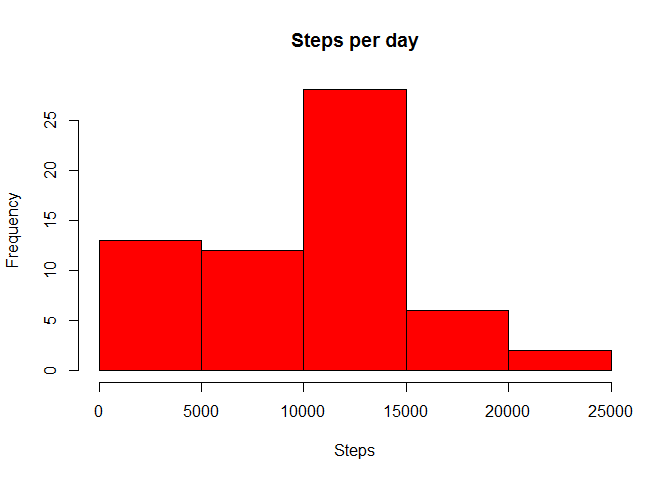
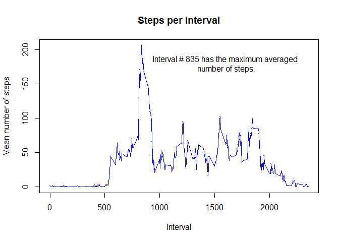
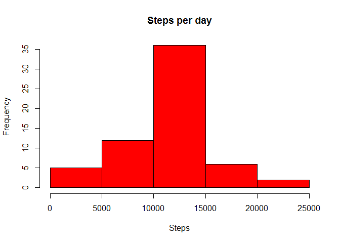

# Reproducible Research: Peer Assessment 1


## Loading and preprocessing the data

```r
file=unzip('activity.zip')
data <- read.csv(file)
head(data)
```

```
##   steps       date interval
## 1    NA 2012-10-01        0
## 2    NA 2012-10-01        5
## 3    NA 2012-10-01       10
## 4    NA 2012-10-01       15
## 5    NA 2012-10-01       20
## 6    NA 2012-10-01       25
```

## What is mean total number of steps taken per day?

We start this analyse by plotting an histogram of the number of steps per days, and calculating the mean and median of steps per days.


```r
stepsday <- tapply(data$steps, data$date, sum, na.rm=T)
hist(stepsday,
     col = "red",
     main = "Steps per day",
     xlab = "Steps")
```

 

The mean number of steps per days is **9354.2295082** and the median number of steps is **10395**.


## What is the average daily activity pattern?


```r
interval <- unique(data$interval)
stepsinterval <- tapply(data$steps, data$interval, mean, na.rm=T)

plot(interval, 
     stepsinterval, 
     pch = '.',
     main = "Steps per interval",
     xlab = "Interval",
     ylab = "Mean number of steps")

lines(interval, stepsinterval, col = "blue")

text(1600, 
     180, 
     sprintf("Interval # %s has the maximum averaged\n number of steps.", names(which.max(stepsinterval))) )
```

 


## Imputing missing values


```r
missval <- is.na(data$steps)
```

Number of missing values is **2304**. 


```r
# Replace missing value with the mean value for the interval

dataNa <- data
dataNa$steps[which(missval)] <- stepsinterval[match(data$interval[which(missval)], interval)]

stepsdayNa <- tapply(dataNa$steps, dataNa$date, sum,na.rm=T)
hist(stepsdayNa,
     col = "red",
     main = "Steps per day",
     xlab = "Steps")
```

 


The mean number of steps per days is **1.0766189\times 10^{4}** and the median number of steps is **1.0766189\times 10^{4}**. 

## Are there differences in activity patterns between weekdays and weekends?


```r
library(lattice)

dataNa$weekday <- as.factor(apply(dataNa, 1, FUN = function(x) if ((weekdays(as.Date(x[2]), 
    abbreviate = T) %in% c("Sat", "Sun"))) {
    "Weekend"
} else {
    "Weekday"
}))

dataPlot <- aggregate(dataNa$steps, by = list(dataNa$interval, dataNa$weekday), FUN = mean)

names(dataPlot) <- c("interval", "weekday", "steps")

xyplot(dataPlot$steps ~ dataPlot$interval | dataPlot$weekday, 
       type = "l", 
       ylab = "Number of steps", 
       xlab = "Interval", 
       layout = c(1, 2))
```

 


